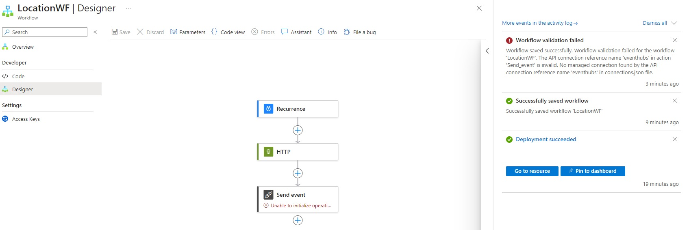

# FabricISSTracking
This is a step-by-step guide to create a near-real time system to track the current location as well as the astronauts aboard the International Space Station in Fabric. 

Inspired and adapted from [Anshul Sharma's blog] and [Tales from the Field's Youtube Tutorial].

[Anshul Sharma's blog]: https://www.linkedin.com/pulse/real-time-monitoring-international-space-station-microsoft-sharma/
[Tales from the Field's Youtube Tutorial]: https://www.youtube.com/watch?v=-HhU7yLyuUU

## Services Used:
1. Logic Apps: gets data from the API and sends it to Event Stream.
2. Event Stream: 
3. KQL Database: to store the incoming data
4. PowerBI: to visualize the incoming data

## Part One: Collecting the Data 
### 1. Create a Logic App (in Azure):
* Log into the Azure Portal
* In the search bar, search for Logic App. On the Logic App menu click on "Create".
* In the setup box for the Logic App, create a new resource group and name it "ISSTrackingSystem"
* Choose a name for the Logic App, e.g. "LocationTrackerLA" (The suffix "LA" stands for Logic App).
* In the "monitoring" tab, turn off the monitoring (not necessary for this project as it is not in production).
* Keep all the other default settings as they are. Click on Review + Create --> Create. This process may take a few minutes.
* Repeat all these steps to create another logic app in the same resource group (ISSTrackingSystem), with the name "AstronautTrackerLA".

### 2. Create a KQL Database (in Fabric):
* In a separate tab, log into Microsoft Fabric (www.app.powerbi.com).
* On the menu bar located on the left of the screen, click on "Create" --> "See All" (under "Other Items You Can Create with Fabric") --> Scroll down to the Real-Time Analytics tab and select KQL Database.
* Name the KQL Database as "ISSTrackerDB" and click on "Create".
* This KQL Database will later be used to store the real-time data of both the location of the ISS, as well as the astronauts aboard.

### 3. Create an Eventstream (in Fabric):
* Go back to the home of Fabric to create an Eventstream.
* Name it "LocationES" and click on "Create".
* In the source box, select custom app and insert the name of the first Logic App ("LocationTrackerLA").

* Open the Notepad application on your computer and copy the "Connection String Primary Key" into it. Make sure to unhide the key first in order to copy it.
* In the Notepad application, split this key in 2 parts at the semi-colon before EntityPath. Make sure to remove the semi-colon.
* The first part of the connection string is the "Service Bus Connection String" and the second part is the EventHub name, both of which we will require in the next steps.

* Return to the Fabric window and repeat all the steps from this section to create another Eventstream called "AstronautES". Make sure to also copy its Connection String separately in the Notepad.

### 4. Create Workflows (in Logic Apps in Azure):
* Head over to the Logic App called "LocationTrackerLA" in the Azure portal. Under the workflows tab, click on "Create".

* Name the workflow "LocationWF" and make sure to select "STATEFUL". Click on "Create".
* Once created, head inside the workflow. In the "Code" tab on the left side, replace the deafult code with the code present in this Github repository's file under the folder "LogicApps" --> get-iss-location.json. Click on "Save".

* Head over to the "Designer" tab. You may now see a warning e.g. "Workflow Validation Failed!". To resolve the warning complete the steps below:
  1) Right click on "Send Event" and delete it. Then add it again using the plus icon --> "Add an Action".
  2) Search for "Send Event" (Make sure to select the "Send Event" from Event Hubs!).
  3) For Create Connection use the following settings: Connection Name: Connection1, Authentication Type: Access Key, Connection String: *Insert connection string* --> Create New
  4) Event Hub Name: *Insert Event Hub Name*, Advanced Param: Content, Content: HTTP Body.
  5) Save this and head back to overview. Run it and now the runs should succeed.
* Repeat the procedure from this section to create another workflow called "AstronautsWF".

### 5. Data Destination (in Fabric):
* Head back to Fabric and select the first eventstream (LocationES). Change the destination to KQL Database. Select Direct Ingestion Mode. Destination Name: LocationDest. Select workplace where you had created the KQL Database. Then, select the KQL Database.

* In the menu box which appears, select "Create New Table" and name it "LocationData".
* In the next tab change the data format to "JSON" and in advanced properties change nested levels to 2 (to separate the longitude and latitude). Also change the data type to "real" for the latitude and longitude columns. For the timestamp column, change the data type to string and then set the Mapping Transformation to "DateTimeFromUnixSeconds".

* For the second Eventstream (AstronautES), again change the destination to KQL Database (Destination Name: AstronautDest) and seelct the same KQL DB as in ther previous step. Create a new table called "AstronautData". In the "Configure the Data source" menu, under Advanced Filters --> Event system properties: select "x-opt-enqueued-time". Change data format to JSON.

## Part Two: Visualization in PowerBI

### 1) KQL Query (in Fabric):
* In Fabric create a KQL Query.
* Copy the code from the Github folder "KQL Query" into the canvas.
* The code contains 3 queries. To run each of the three queries separately, highlight the code you want to run and press on "run".
...*  Query 1: Shows the position of the ISS on the map along with the timestamps.
...*  Query 2: Shows a list of astronauts on the ISS.
...*  Query 3: Shows the location data.

### 2) PowerBI Report (in PBI Desktop):
* Download the PowerBI report from the Github folder "PBI" and open the file in PBI Desktop.
* You will notice the map at the center of the canvas will not load.
* Go to Transform data. Also here you will see an error message like "Expression.Error: Access to the resource is forbidden." This is because this is not our KQL cluster. In order to change to our KQL cluster, head over to the KQL database we created in Fabric. Copy the Query URI in a Notepad as we will need it in PBI Desktop to query our Kusto cluster.
* Go back to PBI Data Explorer and in the applied steps on the right, click on the settings button for source. In "Cluster" enter the Query URI. For "Database", write the nae of the KQL Database. In the Query box, add the first query from the KQL Query from the previous step and click "OK".
* Change the column name of the longitude and latitude column to "longitude" and "latitude" respectively for easier visualization.
* Repeat the same steps also for the "get-Astronauts" query (but insert 2nd KQL Query here) and for "ISSOrbit" (insert 3rd KQL Query here). In ISS Orbit, change the name of the longitude and latitude column to "longitude" and "latitude".
* Change the parameter in "kql_db_url" to your own query URI. "kusto_db_name" can stay the same.
* Click on "Close and Apply".
* In a few minutes, the visualization should load and you should be able to see the location of the ISS (updates every 5 min).

Congratulations, you have reached the end of the project!

